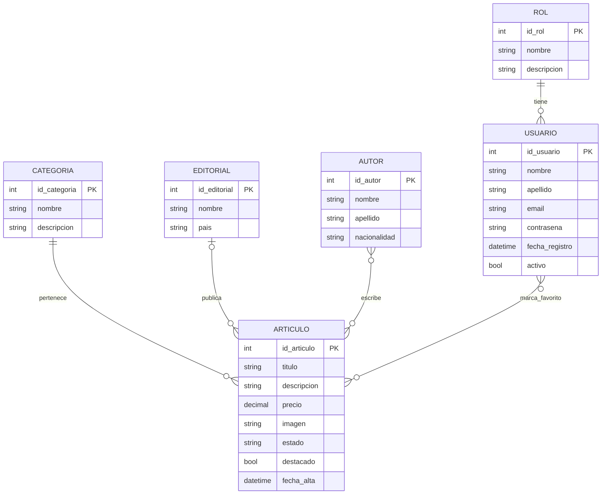

# Modelo Entidad-Relación (MER) — Biblioteca Virtual

## Análisis

A partir de la landing page del Práctico 1 se identificó la información que el sitio necesita guardar:

| Elemento de la landing                         | Información necesaria                         |
|------------------------------------------------|-----------------------------------------------|
| Botón **Iniciar Sesión**                       | Usuarios con email, contraseña y **rol**      |
| Secciones **Libros / Audiolibros / Revistas**  | **Categorías** de los artículos               |
| Cards del catálogo (imagen, título, autor, $)  | **Artículos**, sus **autores** y su precio    |
| Revistas (VOGUE, Rolling Stone, MARCA…)        | **Editorial** / publicación de cada revista   |
| Sección **Más vendidos**                       | Marca de artículo **destacado**               |
| Botón **♥** (favoritos)                        | Artículos favoritos de cada usuario           |

## Entidades y atributos

> **PK** = clave primaria (subrayada en el diagrama clásico).

- **ROL** (<u>id_rol</u>, nombre, descripcion)
- **USUARIO** (<u>id_usuario</u>, nombre, apellido, email, contrasena, fecha_registro, activo)
- **CATEGORIA** (<u>id_categoria</u>, nombre, descripcion)
- **AUTOR** (<u>id_autor</u>, nombre, apellido, nacionalidad)
- **EDITORIAL** (<u>id_editorial</u>, nombre, pais)
- **ARTICULO** (<u>id_articulo</u>, titulo, descripcion, precio, imagen, estado, destacado, fecha_alta)

## Relaciones y cardinalidades

| Relación    | Entidades             | Cardinalidad | Lectura                                                                                       |
|-------------|-----------------------|:------------:|-----------------------------------------------------------------------------------------------|
| **tiene**   | ROL — USUARIO         | **1 : N**    | Un rol lo tienen muchos usuarios; cada usuario tiene un solo rol (obligatorio).               |
| **pertenece** | CATEGORIA — ARTICULO | **1 : N**    | Una categoría agrupa muchos artículos; cada artículo pertenece a una sola categoría.         |
| **publica** | EDITORIAL — ARTICULO  | **1 : N**    | Una editorial publica muchos artículos; un artículo tiene 0 o 1 editorial (opcional).         |
| **escribe** | AUTOR — ARTICULO      | **N : M**    | Un autor escribe muchos artículos y un artículo puede tener varios autores (0..N en revistas). |
| **marca_favorito** | USUARIO — ARTICULO | **N : M** | Un usuario marca muchos artículos como favoritos y un artículo es favorito de muchos usuarios. Atributo de la relación: `fecha_agregado`. |

## Diagrama

Notación de las líneas (pata de gallo): `||` exactamente uno, `|o` cero o uno, `o{` cero o muchos.

Las relaciones **N : M** (`escribe` y `marca_favorito`) se transforman en tablas propias en el [pasaje a tablas](pasaje_a_tablas.md).
