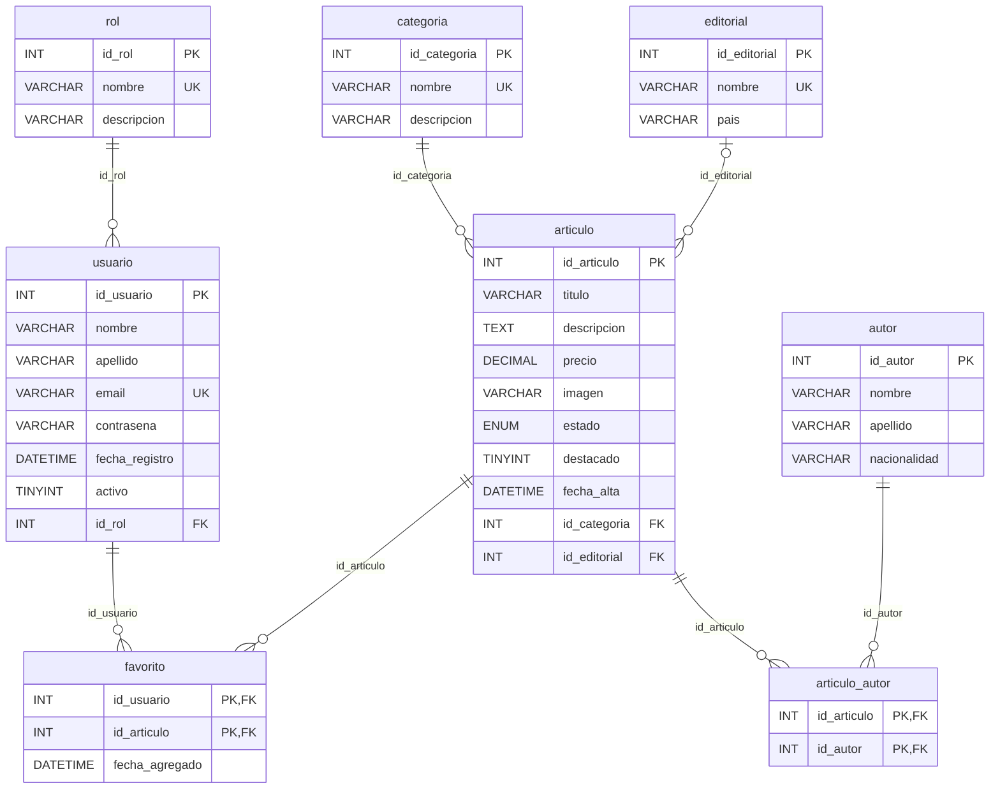

# Pasaje a tablas — Biblioteca Virtual

Notación: **<u>subrayado</u>** = clave primaria (PK) · *#cursiva* = clave foránea (FK).

## Reglas aplicadas

1. Cada **entidad** se transforma en una tabla con sus atributos; su identificador pasa a ser la PK.
2. En las relaciones **1 : N** la PK del lado "1" pasa como **FK** a la tabla del lado "N".
3. Las relaciones **N : M** se transforman en una **tabla intermedia** cuya PK es la combinación de las PK de ambas entidades (cada una también es FK). Los atributos de la relación quedan en esa tabla.

## Tablas

```
ROL            ( id_rol, nombre, descripcion )
USUARIO        ( id_usuario, nombre, apellido, email, contrasena, fecha_registro, activo, #id_rol )
CATEGORIA      ( id_categoria, nombre, descripcion )
AUTOR          ( id_autor, nombre, apellido, nacionalidad )
EDITORIAL      ( id_editorial, nombre, pais )
ARTICULO       ( id_articulo, titulo, descripcion, precio, imagen, estado, destacado, fecha_alta,
                 #id_categoria, #id_editorial )
ARTICULO_AUTOR ( #id_articulo, #id_autor )
FAVORITO       ( #id_usuario, #id_articulo, fecha_agregado )
```

| Tabla              | Clave primaria                       | Claves foráneas                                                       | Origen                          |
|--------------------|--------------------------------------|-----------------------------------------------------------------------|---------------------------------|
| **rol**            | <u>id_rol</u>                        | —                                                                     | Entidad ROL                     |
| **usuario**        | <u>id_usuario</u>                    | *id_rol* → rol(id_rol)                                                | Entidad USUARIO + relación 1:N *tiene* |
| **categoria**      | <u>id_categoria</u>                  | —                                                                     | Entidad CATEGORIA               |
| **autor**          | <u>id_autor</u>                      | —                                                                     | Entidad AUTOR                   |
| **editorial**      | <u>id_editorial</u>                  | —                                                                     | Entidad EDITORIAL               |
| **articulo**       | <u>id_articulo</u>                   | *id_categoria* → categoria(id_categoria)<br>*id_editorial* → editorial(id_editorial) (admite NULL) | Entidad ARTICULO + relaciones 1:N *pertenece* y *publica* |
| **articulo_autor** | <u>(id_articulo, id_autor)</u>       | *id_articulo* → articulo(id_articulo)<br>*id_autor* → autor(id_autor) | Relación N:M *escribe*          |
| **favorito**       | <u>(id_usuario, id_articulo)</u>     | *id_usuario* → usuario(id_usuario)<br>*id_articulo* → articulo(id_articulo) | Relación N:M *marca_favorito* |

## Restricciones adicionales

| Tabla      | Restricción                                    | Motivo                                                       |
|------------|------------------------------------------------|--------------------------------------------------------------|
| rol        | `nombre` UNIQUE                                | No puede haber dos roles con el mismo nombre                 |
| usuario    | `email` UNIQUE                                 | El email se usa para iniciar sesión                          |
| categoria  | `nombre` UNIQUE                                | Evita categorías duplicadas                                  |
| editorial  | `nombre` UNIQUE                                | Evita editoriales duplicadas                                 |
| articulo   | `precio >= 0` (CHECK)                          | No se permiten precios negativos                             |
| articulo   | `estado` ∈ {'Disponible', 'No disponible'}     | Disponibilidad del artículo en el catálogo                   |

## Acciones referenciales

| FK                              | ON DELETE  | Justificación                                                         |
|---------------------------------|------------|-----------------------------------------------------------------------|
| usuario.id_rol                  | RESTRICT   | No se puede borrar un rol que tenga usuarios asignados                |
| articulo.id_categoria           | RESTRICT   | No se puede borrar una categoría que tenga artículos                  |
| articulo.id_editorial           | SET NULL   | Si se borra la editorial, el artículo queda sin editorial             |
| articulo_autor.*, favorito.*    | CASCADE    | Al borrar un artículo, autor o usuario se borran sus vínculos         |

## Diagrama de tablas



La implementación en SQL está en [`database/biblioteca.sql`](../database/biblioteca.sql).
